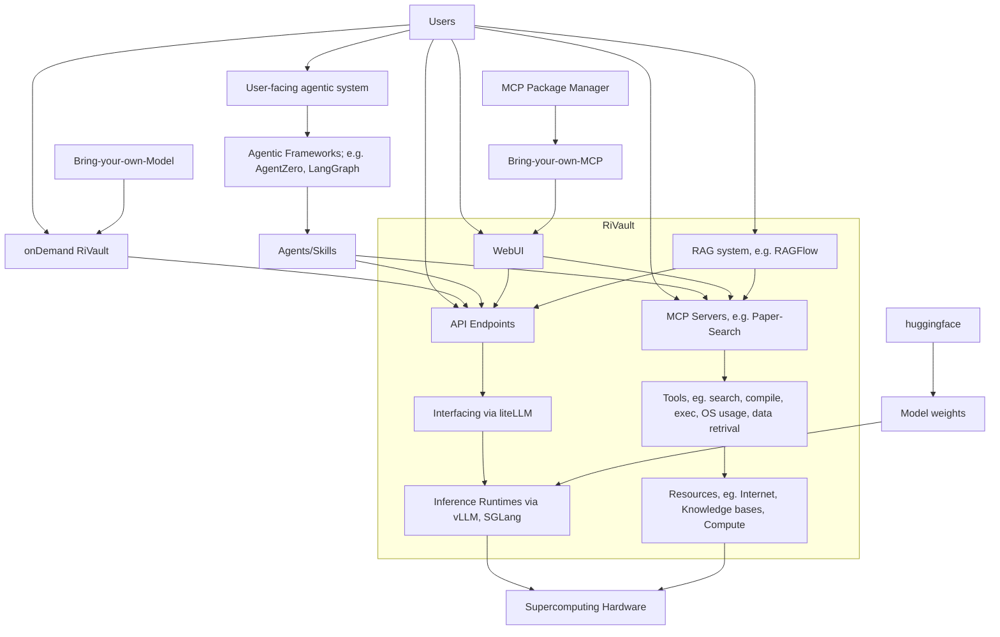

# RiVault
RIKEN's internal AI Inference Infrastructure for Scientific Computing and General-purpose Applications

## Overview

RiVault is a security-first AI Inference infrastructure designed for scientific computing and general-purpose applications at RIKEN ([\[1\] Overview Slides](slides/RiVault-Intro-AI4Sci-system.pdf)). It provides users with multiple access methods to leverage powerful AI models and capabilities, through a web-based interface, API endpoints, and support for custom agentic systems.

Note: currently RiVault is only accessible from within RIKEN intranet. For [AI for Science Supercomputer](https://github.com/RIKEN-RCCS/AI-for-Science-Supercomputer) (pre-)production, we plan to make it available more broadly.

## System Architecture

The following diagram illustrates the RiVault setup and how users interact with its components:

## Access Methods

Users can interact with RiVault through several pathways:

- **WebUI**: A graphical web interface for direct interaction [\[1\]](slides/RiVault-Intro-AI4Sci-system.pdf)
- **API Endpoints**: Programmatic access for integration into workflows
- **MCP Servers**: Model Context Protocol servers for extended functionality
- **RAG System**: Retrieval-Augmented Generation capabilities, e.g., RAGFlow
- **onDemand RiVault**: Custom deployments with bring-your-own models

### WebUI Features

The WebUI provides an intuitive control interface [\[1\]](slides/RiVault-Intro-AI4Sci-system.pdf):
- **Left panel**: Access to previous chats and new chat creation
- **Middle**: Dropdown menu to select model(s)
- **Top-right**: Detailed configuration options for chats
- **Bottom of chat**: Additional features including image generation, text-to-speech, rating, retry, and translations

## MCP Servers

RiVault supports MCP (Model Context Protocol) servers to extend functionality. Examples include [\[1\]](slides/RiVault-Intro-AI4Sci-system.pdf):

- **papersearch**: Retrieves live paper information from arXiv, bioRxiv, and other scientific repositories
- **time**: Provides time information

Users can also bring their own MCP servers through the MCP Package Manager.

## Core Components

### Inference Layer
- **Interfacing**: Uses liteLLM for unified model access
- **Inference Runtimes**: Powered by vLLM and SGLang for efficient model serving
- **Model Weights**: Supports models from HuggingFace or custom bring-your-own models

### Currently deployed models
- [meta-llama/Llama-4-Scout-17B-16E-Instruct](https://huggingface.co/meta-llama/Llama-4-Scout-17B-16E-Instruct) (context limit 100k)
- [zai-org/GLM-4.7-FP8](https://huggingface.co/zai-org/GLM-4.7-FP8)
- [deepseek-ai/DeepSeek-V4-Flash](https://huggingface.co/deepseek-ai/DeepSeek-V4-Flash)
- [Qwen/Qwen3.6-27B-FP8](https://huggingface.co/Qwen/Qwen3.6-27B-FP8)
- [Qwen/Qwen3.6-35B-A3B-FP8](https://huggingface.co/Qwen/Qwen3.6-35B-A3B-FP8)
- google/translategemma-27b-it (translations)
- Kimi-K2-Thinking  (context limit 32k, large thinking model)
- K2-Think  (context limit 64k, midsize reasoning model)
- codellama:7b  (fast coding model; good for code completions)
- qwen3-coder:30b  (context limit 128k; midsize coding model; released 2025/07)
- zai-org/GLM-4.7-Flash (context limit 200k; midsize coding model; released 2026/01)
- qwen3:8b  (small / simple reasoning model)
- gemma3:12b  (small / simple reasoning model)
- llava:7b  (vision encoder)
- bge-m3:567m  (embedding model)

### Agentic Systems
- **Frameworks**: Supports AgentZero, LangGraph, and other agentic frameworks
- **Agents/Skills**: Custom agents that can access both APIs and MCP servers

### Tools & Resources
- **Tools Layer**: Provides search, compilation, execution, OS usage, and data retrieval capabilities
- **Resources**: Connects to internet, knowledge bases, and compute resources
- **Supercomputing Hardware**: All computation runs on RIKEN's supercomputing infrastructure

## Getting Started

1. **Access the WebUI**: Navigate to the RiVault web interface to start chatting with models
2. **Select a Model**: Use the dropdown in the middle of the interface to choose your preferred model [\[1\]](slides/RiVault-Intro-AI4Sci-system.pdf)
3. **Configure Settings**: Adjust parameters using the top-right configuration options [\[1\]](slides/RiVault-Intro-AI4Sci-system.pdf)
4. **Try MCP Servers**: Access extended functionality like paper search directly from the chat interface [\[1\]](slides/RiVault-Intro-AI4Sci-system.pdf)
5. **API Access**: Use API endpoints for programmatic integration into your workflows

## Support

For additional assistance or to deploy custom MCP servers and models, please refer to the documentation or contact the RiVault support team via RIKEN's internal slack or the issue tracker in this repo.
